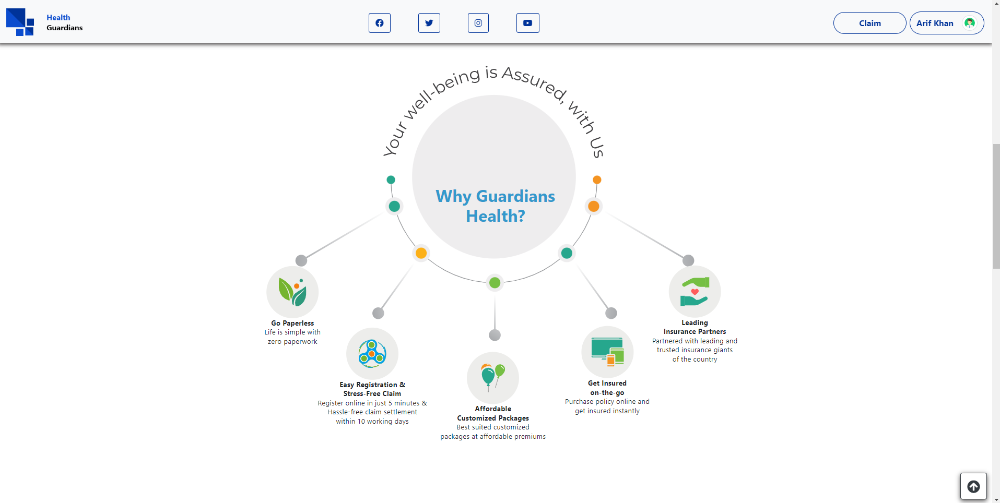

# Insurance

it's a Insurance management project with admin site fully developed by PHP, HTML, CSS, Javascript

I'd be happy to guide you through the process of running your PHP project. Here are the steps you'll need to follow:

1. Install a local server environment:
You'll need a local server environment to run your PHP project. One of the most popular options is XAMPP. Here's how you can do it: <a href="https://sourceforge.net/projects/xampp/" target="_blank" > Download XAMPP </a>
Install XAMPP: Follow the installation instructions provided by the XAMPP installer.

2. Start Apache Server: After installation, launch XAMPP and start the Apache server. This will start your local server environment.

3. Place PHP Files:
Locate the directory where your PHP files are stored. Usually, PHP files are stored in the htdocs folder inside the XAMPP directory.
Copy or move PHP project files to this directory.

4. Access Your Project:
Open a web browser and type localhost in the address bar. This will take you to the XAMPP welcome page.
To access PHP project, navigate to localhost/insurance/ in your browser. Replace project_folder with the actual name of your project folder.

5. Set Up a Database : you'll need to set up a database using tools like phpMyAdmin (included in XAMPP):
In your browser, go to localhost/phpmyadmin.
Create a new database and import your database file from <b> ./database/ </b> .
  

7. Configure Database Connection:
  <h6> Database Config files: php/databaseConnect.php</h6>  

8. Configure Mail :
  <h6> Database Config in register file: php/register.php : 80</h6>   

If PHP project connects to a database, make sure the connection details (like hostname, username, password, database name) in your project's configuration files match the settings of your local database.

